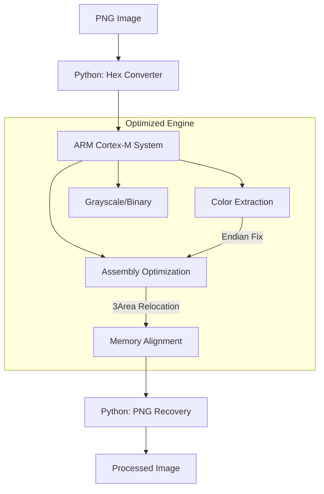

# 🖼️ ARM PNG Compressor
**"C 컴파일러의 한계를 ARM 어셈블리어 최적화로 극복한 이미지 처리 프로젝트입니다."**  

---
## 🛠 해결한 문제 (Problem Solving)
### 1. 엔디안(Endian) 불일치로 인한 이미지 색상 왜곡 해결
- **문제**: 출력 이미지가 붉게 변하고 그레이스케일 결과물이 끊기는 현상이 발생했습니다.
- **사고**: MDK 디버깅 결과 메모리가 리틀 엔디안 방식으로 저장됨을 확인했습니다.
- **사고**: 알파 채널의 `0xFF`가 하위에서 상위로 읽히며 빨간색으로 오인되고 있었습니다.
- **해결**: 리틀 엔디안 구조를 반영하여 비트 순서를 재조정했습니다.
- **해결**: 정확한 색상 값을 추출하여 왜곡 문제를 완벽히 해결했습니다.
### 2. 컴파일러의 레지스터 관리 한계 극복을 통한 성능 병목 해결
- **문제**: C언어 코드가 ARM 어셈블리 코드보다 약 2배 가까이 느린 병목이 발견되었습니다.
- **사고**: 역어셈블리 분석 결과 C 컴파일러가 레지스터 부족으로 스택을 반복 사용함을 확인했습니다.
- **해결**: 유휴 레지스터를 즉시 활용하는 핸드 최적화로 메모리(Stack) 접근을 제거했습니다.
- **해결**: 컴파일러 대비 실행 시간을 **약 42% 단축**하는 성과를 거두었습니다.
### 3. 메모리 정렬(Alignment) 제약 해결을 위한 데이터 재배치
- **문제**: 3바이트 RGB 처리 시 4바이트 단위 메모리 접근 제한으로 연속 읽기가 불가능했습니다.
- **사고**: 1바이트씩 읽는 방식은 성능이 저하되어 채널별 독립 영역 배치(병렬화)가 필요했습니다.
- **해결**: R, G, B 채널을 별도 영역에 저장하는 **'3Area' Memory Relocation**을 적용했습니다.
- **해결**: 4바이트 단위 읽기가 가능해졌으며 **약 50~70ms**의 추가 성능 이득을 확보했습니다.
---
## ✨ 주요 기능 (Key Features)
- **Color Correction**: 리틀 엔디안 보정을 통한 정확한 RGBA 채널 복원
- **Fast Transformation**: 고속 그레이스케일 및 이진화 처리 엔진
- **Hand Optimization**: ARM 어셈블리 기반 레지스터 최적화 연산
- **Memory Efficiency**: 3Area 재배치를 통한 메모리 액세스 극대화

---
## 🛠 기술 스택 (Tech Stack)
- **Languages**: C, ARM Assembly, Python
- **Tools**: Keil MDK, ARM Compiler, Python (Pillow)
- **Environment**: ARM Cortex-M Memory Map
---
## 💡 성장 및 향후 계획
- **배운 점**: 하드웨어 아키텍처에 최적화된 코드가 성능에 주는 극적인 영향을 배웠습니다.
- **향후 계획**: 압축 알고리즘을 추가하여 실제 PNG 압축률까지 개선해보고 싶습니다.
---
## 🛠 빌드 및 실행
1. `4_Python_Script/png_to_RGBA_IntelHex.py`로 이미지를 헥사로 변환합니다.
2. Keil MDK에서 프로젝트를 빌드한 후 ARM 시뮬레이터에서 실행합니다.
3. 생성된 헥사를 다시 Python 스크립트로 변환하여 결과 이미지를 확인합니다.
---
## 🏗 아키텍처 (Architecture)

